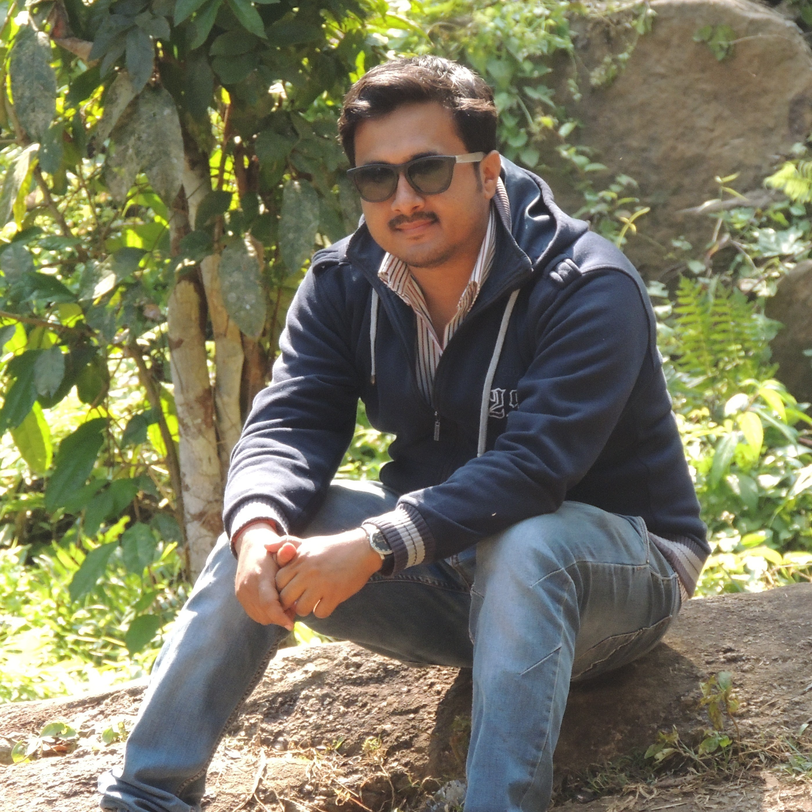

<html lang="fr"><head>
<meta http-equiv="content-type" content="text/html; charset=UTF-8">
<meta charset="utf-8">
<meta http-equiv="X-UA-Compatible" content="IE=edge,chrome=1">
<meta name="viewport" content="width=device-width, initial-scale=1.0">

<title>Anirban Lekharu</title>

<!--[if lt IE 9]>

<![endif]-->

<!-- Fichiers CSS -->
<link rel="stylesheet" href="reset.css">
<!--[if lt IE 9]> 
	<link rel="stylesheet" href="css/cv.css" media="screen">
<![endif]-->
<link rel="stylesheet" media="screen and (max-width:480px)" href="mobile.css">
<link rel="stylesheet" media="screen and (min-width:481px)" href="cv.css">
<link rel="stylesheet" media="print" href="print.css">
</head>

<body>

	<!-- Header -->
	<header role="banner">
		

				<hgroup>
					<h1>Anirban Lekharu</h1>
					<h4 style="line-height:2.0px;color:#0566A5">PHD, Computer Science and Engineering</h4>
					<h4 style="line-height:0.1px;color:#0566A5">Indian Institute of Technology Guwahati</h4>
					<h4 style="line-height:0.1px;color:#0566A5">Guwahati-781039, Assam, India</h4>
					<h4 style="line-height:0.1px;color:#0566A5">Email: anirban2012@iitg.ac.in</h4>
				</hgroup>

				<figure>
					
				</figure>
		

	</header>
	
	<!-- Contact
	<section class="contactform clearfix">
		

			<h3>Contactez-moi</h3>
			
Remplissez le formulaire ci-dessous afin de m'envoyer un message. Je vous répondrais dans les plus bref délai. 
			 <em>Tous les champs sont requis.</em>

			<form novalidate="novalidate" method="post" action="#" name="contact" class="grid_16">
				
<textarea name="message" placeholder="Votre message" class="required"></textarea>

				

					<input name="nom" placeholder="Nom - Prénom" class="required" type="text">
					<input name="email" placeholder="Adresse email" class="required" type="email">	
					<input name="envoi" value="Envoyer le message" class="required" type="submit">
					
				

			</form>
		

	</section>
-->
	
	<!-- Corps -->
	<section role="main" class="container_16 clearfix">
		

			<!-- A propos -->
			

				<h3>About</h3>
				
Experienced Research professional with a Master’s Degree focused in COMPUTER SCIENCE AND ENGINEERING from Indian Institute of Technology, Guwahati. Skilled in C++, C, Python, Matlab, HTML and JavaScript. Working in Multimedia Streaming services like DASH and cutting edge 5G Network Technologies like Network Slicing and Network Caching. 

			

			
			<!-- Compétences -->
			

				<h3>Research Interest</h3>
				<ul class="barres" style="list-style-type:disc;">
					<li>Multimedia Streaming Technologies</li>
					<li>5G Network Services like Network Slicing and Caching</li>
					<li>Machine Learning</li>
					<li>Computer Vision</li>
					<li>Multimedia Security</li>
				</ul>
			

		

		
			<!-- Publications -->
			

				<h3>Publications</h3>
				<ul class="barres" style="list-style-type:square;">
					<li>
						<h4 style="text-align:justify">Anirban Lekharu, Satish Kumar, Arijit Sur and Arnab Sarkar<b><i> "A QoE aware LSTM based bit-rate prediction model for DASH video."</b></i> In Communication Systems & Networks (COMSNETS), 2018 10th International Conference on, pp. 392-395. IEEE, 2018, DOI:  10.1109/COMSNETS.2018.8328225 ISBN: 978-1-5386-1182-1 <a href="https://ieeexplore.ieee.org/document/8328225"> URL: https://ieeexplore.ieee.org/document/8328225 </a></h4>
						
					</li>
					<li>
						<h4 style="text-align:justify"> Anirban Lekharu, Satish Kumar, Arijit Sur and Arnab Sarkar<b><i> "A QoE Aware SVC Based Client-side Video Adaptation Algorithm for Cellular Networks"</i></b>. In ICDCN 18: 19th International Conference on Distributed Computing and Networking, January 4–7, 2018, Varanasi, India. ACM, New York, NY, USA. DOI: 10.1145/3154273.3154312 ISBN: 978-1-4503-6372-3/18/01 <a href="https://doi.org/10.1145/3154273.3154312"> URL: https://doi.org/10.1145/3154273.3154312 </a></h4>
					</li>
					<li>
						<h4 style="text-align:justify"> Gaj, S., Rana, S., Lekharu, A., Sur, A., Bora, P<b><i> "RST Invariant Multi
						View 3D Image Watermarking Using DWT and SVD"</i></b>. in Proceedings of the Fifth National Conference on Computer Vision, Pattern Recognition, Image Processing and Graphics 2015 DOI: DOI: 10.1109/NCVPRIPG.2015.7490066 <a href="http://dx.doi.org/10.1109/NCVPRIPG.2015.7490066"> URL: http://dx.doi.org/10.1109/NCVPRIPG.2015.7490066 </a></h4>
					</li>
				</ul>
			

		
			<!-- Patent -->
			

				<h3>Patent</h3>
				<ul class="barres" style="list-style-type:square;">
					<li>
						<h4 style="text-align:justify"><b>Watermark Evaluation Tool (Indian Patent Applied ) </b> Application No:
T.I.(47)/TIFA/2016 dt. August 24, 2016 </h4>
					</li>
				</ul>
			

			

				<h3>Educational Achievements</h3>
				<ul class="barres" style="list-style-type: square; margin-bottom: 20px;">
					<li style="text-align: justify;margin-left: 55px">
						Participated and Presented Paper in <b><i>IEEE 10th International Conference on COMmunication Systems and NETworkS (Comsnets) 2018 </i></b>, held in Bangalore.
					</li>
					<li style="text-align: justify;margin-left: 55px">
						Organizing Committee member of <b><i>“Indian Conference on Computer Vision, Graphics and Image Processing (ICVGIP)” </i></b>, 18 - 22 December, 2016.
					</li>
					<li style="text-align: justify;margin-left: 55px">
						<b><i>First Class First in BE</i><b> (Computer Science and Engineering) under <b>Gauhati University (2012)</b>
					</li>
					<li style="text-align: justify;margin-left: 55px;">
						Awarded the <b><i>Simon Kachari Award </i></b> for All Round Best Student of <b>Faculty Higher
						Secondary School (2007-08)<b>
					</li>
				</ul>
			
	
			<!-- Research Experience  

			

				<h3 style="margin-top: 50px;">Research Experience</h3>
				<ul class="barres" style="list-style-type:square;">
					<li>
						<h4><strong>QoE Aware Client-side Video Adaptation Algorithm for Cellular Networks</strong></h4>
						<ul class="barres" style="list-style-type:circle;">
							<li style="margin-bottom: 1px;text-align:justify">
								
Two client-side Rate Adaptation models are proposed for the <b><i>DASH (Dynamic Adaptive Streaming over HTTP) </i></b> framework in maximizing the Quality of Experience (QoE) of the clients.

							</li>
							<li style="margin-bottom: 1px;text-align:justify">
								
In the first approach Client-side Scalable Video Coding (SVC) based bitrate adaptation
								framework called <b><i>Video Quality Adaptation Framework (VQAF)</i></b> with two distinct phases called the <b>Download</b> and <b>Smooth-out</b>  phases is proposed.

							</li>
							<li style="margin-bottom: 1px;text-align:justify">
								
The <b><i>Download Phase</i></b> fetches new segments at selected quality levels until buffer
								size reaches a stipulated safety Threshold.
								

							</li>
							<li style="margin-bottom: 1px;text-align:justify">
								
The <b><i>Smooth-out Phase</i></b> repeatedly upgrades a subset of the already downloaded
								segments by one enhancement level, until buffer size reduces below the safety Threshold.

							</li>
							<li style="margin-bottom: 1px;text-align:justify">
								
In the next approach a Machine Learning based Rate Prediction model called the <b><i>Video Bit-Rate Prediction Model (VBPM)</i></b> using Long Short Term Memory (LSTM) for Adaptive Streaming over HTTP is proposed.

							</li>
						</ul>
					</li>
					<li>
						<h4><strong>Design, Development of a Watermarking System for a Scalable Video Authentication</strong></h4>
						<ul class="barres" style="list-style-type:circle;">
							<li style="margin-bottom: 1px;text-align:justify">
								
The Proposed Framework evaluates the robustness of the video watermarking schemes against content adaptation attacks as well as general attacks.

							</li>
							<li style="margin-bottom: 1px;text-align:justify">
								
Designed and Integrated the various modules of our Framework.

							</li>
							<li style="margin-bottom: 1px;text-align:justify">
								
Tested the Watermark Framework on different types of videos.

							</li>
						</ul>
					</li>
					<li>
						<h4><strong>Image Captioning with Attention Networks</strong></h4>
						<ul class="barres" style="list-style-type:circle;">
							<li style="margin-bottom: 1px;text-align: justify;">
								
Implemented a model on Image Captioning using Attention Networks.

							</li>
							<li style="margin-bottom: 1px;text-align: justify;">
								
The model was able to generate text descriptions of images which not only captures the objects contained in an image, but it also must express how these objects relate to each other.

							</li>
						</ul>
					</li>
					<li>
						<h4><strong>Activity Recognition for Energy Efficiency in Workplace</strong></h4>
						<ul class="barres" style="list-style-type:circle;">
							<li style="margin-bottom: 1px;text-align: justify;">
								
Presented a model for <b>Human Activity Recognition</b> using Sensor data

							</li>
							<li style="margin-bottom: 1px;text-align: justify;">
								
The model comprised of a PIR, PING and LIGHT sensors which gave us different sensor values of the people activities in performed in the Robotics Lab, Dept. of CSE, IIT Guwahati.

							</li>
							<li style="margin-bottom: 1px;text-align: justify;">
								
Implemented some widely used algorithms to recognize the human activities in the Lab.

							</li>
						</ul>
					</li>
					<li>
						<h4><strong>Security Issues of Internet of Things Smart Home Applications</strong></h4>
						<ul class="barres" style="list-style-type:circle;">
							<li style="margin-bottom: 1px;text-align: justify;">
								
Surveyed and presented a comparative study of various research papers, which found flaws in security mechanism used by ZigBee that works on IoT devices for smart home applications.

							</li>
						</ul>
					</li>
				</ul>
		-->		
			<!--

				<h3>Loisirs</h3>
				
<strong>Sports :</strong> si vous en pratiquez

				
<strong>Association :</strong> si vous êtes membre d'une association

				
D'autres loisirs plus vagues, complétez ici.

			

			-->
			<!-- Contact -->
			<!--

				<h3>Contact</h3>
				
Si mon profil vous intéresse, n'hésitez pas à me contacter :

				<ul>
					<li class="lieu">Paris, France</li>
					<li class="phone">06 00 00 00 00</li>
					<li class="mail"><a href="mailto:mon.adresse@email.fr">mon.adresse@email.fr</a></li>
					<li class="site"><a href="http://www.mon-site.fr/">www.mon-site.fr</a></li>
					<li class="form"><a class="toContactform">via le formulaire de contact</a></li>
                    <li class="form"><a class="toContactform">via le formulaire de contact</a></li>
				</ul>
			

			-->
	</section>

<!-- Scripts JavaScript -->

<!--[if lt IE 9]>

<![endif]-->

</body></html>
